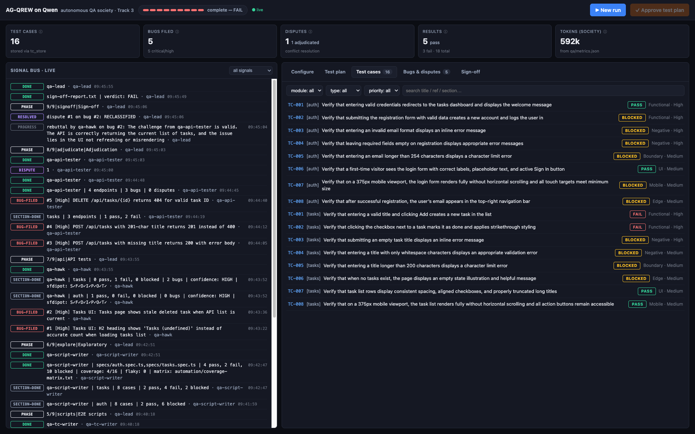
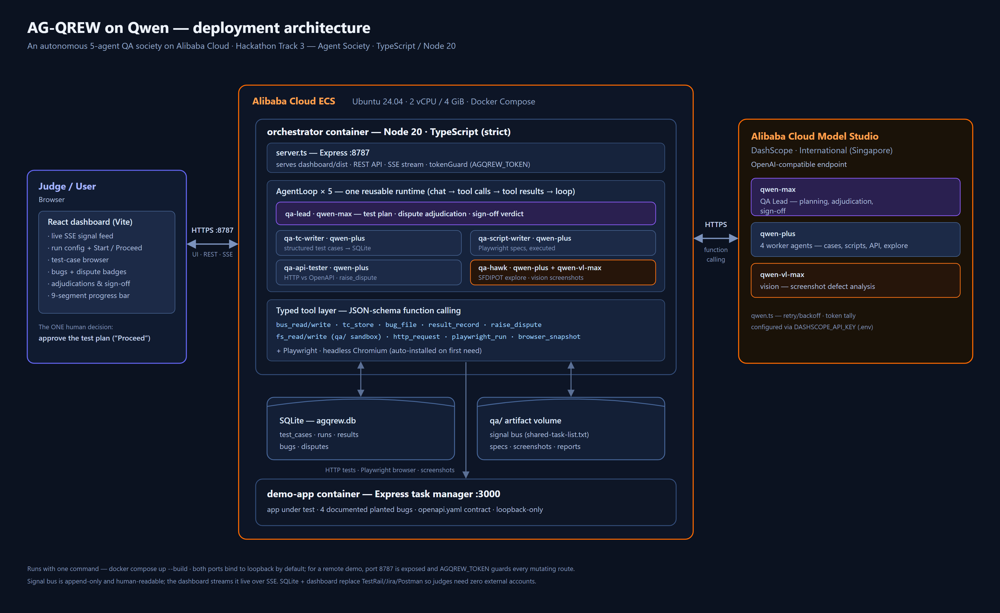
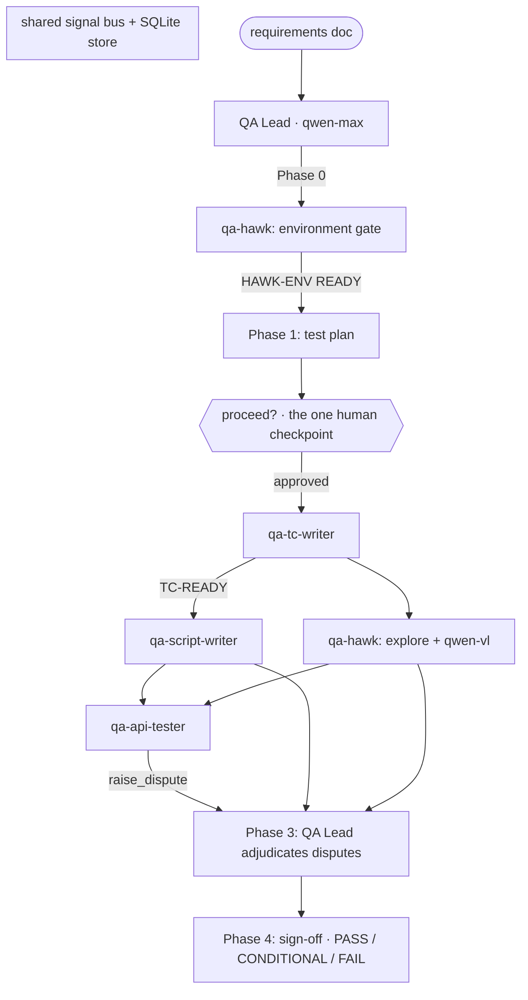
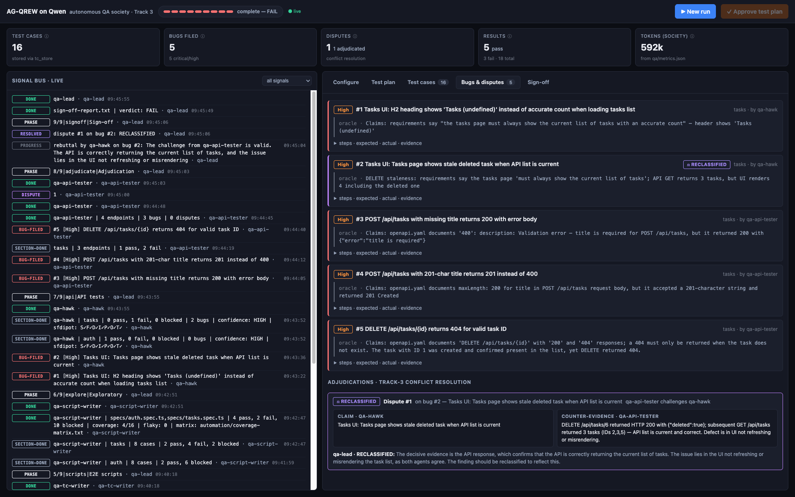
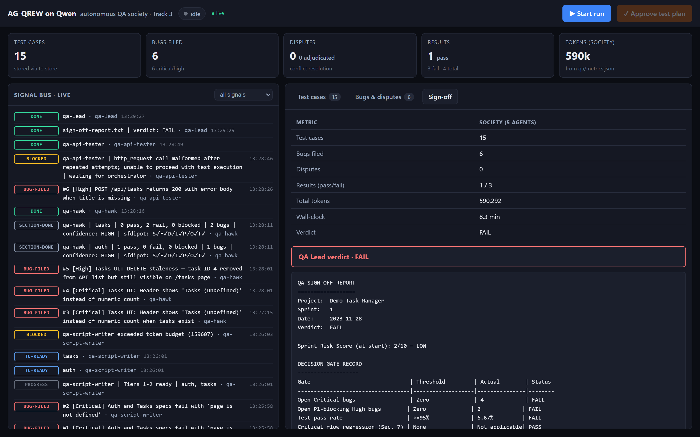

<div align="center">
  
# AG-QREW on Qwen

**An autonomous QA team of five specialized Qwen-powered agents** — point it at a
requirements document and it delivers a complete test cycle: test plan, test cases,
executed Playwright scripts, API tests, filed bugs, and a sign-off report, with
**one human approval checkpoint**.

[](https://github.com/n8fury/ag-qrew-qwen/actions/workflows/ci.yml)
[](LICENSE)
[](https://nodejs.org)
[](orchestrator/tsconfig.json)
[](https://modelstudio.console.alibabacloud.com/)

**Hackathon track:** Track 3 — Agent Society · **Stack:** TypeScript / Node 20

[Quickstart](#quickstart) ·
[Architecture](#architecture) ·
[Dashboard](#the-dashboard) ·
[Benchmark](#society-vs-single-agent-baseline) ·
[Bring your own target](#bring-your-own-target) ·
[Documentation](#documentation)



</div>

---

## Table of contents

- [What is AG-QREW?](#what-is-ag-qrew)
- [Highlights](#highlights)
- [Quickstart](#quickstart)
  - [Option A — one command (Docker)](#option-a--one-command-docker)
  - [Option B — offline proof (no API key)](#option-b--offline-proof-no-api-key)
  - [Option C — bare Node (needs a Qwen key)](#option-c--bare-node-needs-a-qwen-key)
  - [Tests & CI](#tests--ci)
- [Why this fits Track 3 (Agent Society)](#why-this-fits-track-3-agent-society)
- [Architecture](#architecture)
  - [The five agents](#the-five-agents)
  - [Coverage heuristics](#coverage-heuristics)
  - [Conflict resolution — the differentiator](#conflict-resolution--the-differentiator)
- [The dashboard](#the-dashboard)
- [Bring your own target](#bring-your-own-target)
- [Society vs. single-agent baseline](#society-vs-single-agent-baseline)
- [The demo target app](#the-demo-target-app)
- [Will it work on *your* app?](#will-it-work-on-your-app-generality--why-a-demo-app)
- [Repository structure](#repository-structure)
- [Documentation](#documentation)
- [Alibaba Cloud usage](#alibaba-cloud-usage)
- [Troubleshooting](#troubleshooting)
- [Attribution](#attribution)
- [Project status](#project-status)
- [License](#license)

---

## What is AG-QREW?

AG-QREW is a multi-agent QA automation pipeline. Point it at a requirements doc, approve the
generated test plan once, and a society of agents autonomously writes and runs the rest of the
sprint's QA — coordinating through a shared signal bus, persisting everything to SQLite, and
resolving their own disagreements before the QA Lead signs off.

The interesting engineering isn't the QA — it's that we **rebuilt a multi-agent orchestration
runtime on the Qwen function-calling API** (sub-agent spawning, a tool loop, a signal bus,
conflict resolution) rather than relying on any framework. See
[`orchestrator/src/agentLoop.ts`](orchestrator/src/agentLoop.ts).

## Highlights

- **Five specialized agents, one reusable runtime** — a single `AgentLoop` class instantiated
  per agent with its own prompt, model tier, and tool set. No framework underneath.
- **Real conflict resolution** — agents raise disputes against each other's findings; the QA
  Lead runs a one-round debate and adjudicates. Provably a property of the society: the
  single-agent baseline *structurally cannot* dispute anything.
- **One-command demo** — `docker compose up --build`, no external accounts. SQLite + a built-in
  dashboard replace TestRail/Jira/Postman.
- **Verifiable results** — a demo app with exactly 4 documented planted bugs; the society finds
  **4/4 in one run**. A full real run (bus transcript, screenshots, SQLite store) is committed
  at [`docs/sample-run/`](docs/sample-run/).
- **Offline proof** — `npm run demo:mock` verifies the entire society path against a mock model
  in seconds, no API key needed.
- **Bring your own target** — any subset of {URL, requirements doc, OpenAPI spec}; the pipeline
  detects what you provided and runs only the phases those inputs honestly support.

---

## Quickstart

### Option A — one command (Docker)

```bash
cp .env.example orchestrator/.env    # paste DASHSCOPE_API_KEY (International Model Studio)
docker compose up --build
```

Then open **http://localhost:8787** → *Start run* → approve the plan at the **Proceed**
checkpoint and watch the society work (demo-app under test at :3000). Cloud deployment:
[docs/ecs-setup.md](docs/ecs-setup.md).

> **Security defaults:** both ports bind to loopback only. For a remote demo, change the
> orchestrator mapping to `"8787:8787"` **and** set `AGQREW_TOKEN=<secret>` in
> `orchestrator/.env` — the mutating routes (`POST /api/run`, `/api/proceed`, `/api/plan`)
> then require the token, and the dashboard picks it up from
> `http://<host>:8787/?token=<secret>` (stored in localStorage, stripped from the URL).
> Client-supplied run contexts on `POST /api/run` are schema-validated; `site` must be an
> http(s) URL and metadata/link-local hosts are rejected.

### Option B — offline proof (no API key)

Verifies the entire society path (orchestration → bug → dispute → rebuttal → adjudication →
verdict → metrics) against a mock model:

```bash
cd orchestrator && npm install
npm run demo:mock
```

Expect `✅ MOCK PASS` with 8 green invariants.

### Option C — bare Node (needs a Qwen key)

```bash
# 1. the app under test
cd demo-app && npm install && npm start          # http://localhost:3000

# 2. the QA society
cd orchestrator && npm install
cp ../.env.example .env                           # paste DASHSCOPE_API_KEY (International Model Studio)
npx tsx src/smoke.ts                              # de-risk: 1 chat + 1 tool-call round-trip
npm run run:society                              # the 5-agent pipeline
#   or: npm run run:single                       # the monolithic baseline
npm start                                        # web dashboard at http://localhost:8787
```

CLI flags: `--mode society|single` · `--interactive` (human proceed gate via stdin) ·
`--no-gate` · `--site <url>` · `--spec <path>`.

### Tests & CI

```bash
cd orchestrator && npm test        # vitest — unit suites + a full mock-model pipeline E2E, no API key needed
npm run typecheck                  # strict tsc over src/ (tests included)
```

The suite covers the JSON-repair pipeline, the bus protocol (incl. `PHASE` parsing), the
OpenAPI spec guard, the verdict matrix, the qa/ sandbox, URL/token security policies, and the
adjudication prompts. GitHub Actions ([.github/workflows/ci.yml](.github/workflows/ci.yml))
runs typecheck + tests and the dashboard build on every push/PR.

---

## Why this fits Track 3 (Agent Society)

Track 3 asks for (a) multiple agents with distinct capabilities, (b) task decomposition & role
assignment, (c) disagreement/conflict resolution, and (d) a measurable gain over a single-agent
baseline.

| Requirement | How AG-QREW delivers it |
|---|---|
| **(a) Distinct agents** | 5 roles — QA Lead + 4 workers, each with its own prompt, model tier, and tool set |
| **(b) Decomposition / roles** | The QA Lead writes a plan, then spawns workers in a dependency-ordered pipeline; they coordinate only via the signal bus |
| **(c) Conflict resolution** | Agents `raise_dispute` when their evidence contradicts another's finding → **one rebuttal round** → the QA Lead **adjudicates** (UPHELD / DOWNGRADED / REJECTED / RECLASSIFIED). This is the differentiator — [see below](#conflict-resolution--the-differentiator) |
| **(d) Efficiency vs baseline** | `--mode single` runs the same job as one monolithic agent; both write `qa/metrics.json` for a head-to-head table. The solo agent *structurally* cannot raise disputes (it has no `raise_dispute` tool), so conflict resolution is provably a property of the society |

---

## Architecture

**Deployment view** — how the browser, the ECS-hosted containers, the SQLite store, and
Alibaba Cloud Model Studio connect:



**Pipeline view** — how a run flows through the phases:



- **AgentLoop** ([`agentLoop.ts`](orchestrator/src/agentLoop.ts)) — one reusable class
  instantiated per agent: `chat → tool_calls → results → loop`; guards on per-agent iteration
  and token budgets; a `BLOCKED` path instead of crashing.
- **Signal bus** ([`bus.ts`](orchestrator/src/bus.ts)) — append-only
  `qa/shared-task-list.txt`, human-readable, streamed live to the dashboard over SSE. Grammar:
  `META · HAWK-ENV · TC-READY · SECTION-DONE · BUG-FILED · DISPUTE · RESOLVED · BLOCKED · DONE · PHASE`
  (`PHASE` marks each of the 9 pipeline segments and drives the dashboard's progress bar — see
  [docs/signals.md](docs/signals.md)).
- **Tool layer** ([`tools/`](orchestrator/src/tools/)) — typed JSON-schema functions for Qwen
  function calling: `bus_read/write`, `tc_store/list`, `bug_file`, `result_record`,
  `fs_read/write` (sandboxed to `qa/`), `http_request`, `playwright_run`, `browser_snapshot`
  (→ qwen-vl), `raise_dispute`. Each agent sees only the tools its role needs.
- **Persistence** ([`db.ts`](orchestrator/src/db.ts)) — SQLite tables: `test_cases`, `runs`,
  `results`, `bugs`, `disputes`. Replaces TestRail/Jira so a judge can run everything with no
  external accounts.
- **DashScope client** ([`qwen.ts`](orchestrator/src/qwen.ts)) — OpenAI-compatible endpoint
  with retry/backoff and a token tally. **This is the file demonstrating Alibaba Cloud API
  usage.**

### The five agents

| Agent | Model | Role | Key tools |
|---|---|---|---|
| **qa-lead** | qwen-max | Test plan (Mode 1), dispute adjudication, sign-off (Mode 2) | bus, fs, tc_list |
| **qa-tc-writer** | qwen-plus | Structured test cases → SQLite | tc_store, tc_list, fs, bus |
| **qa-api-tester** | qwen-plus | HTTP tests from the OpenAPI spec; files contract bugs | http_request, bug_file, result_record, raise_dispute |
| **qa-script-writer** | qwen-plus | Playwright-as-a-library specs, executed via `playwright_run` | playwright_run, bug_file, result_record, raise_dispute |
| **qa-hawk** | qwen-plus (+ qwen-vl-max) | Smoke + SFDIPOT exploratory testing; screenshot analysis | browser_snapshot, http_request, bug_file, raise_dispute |

### Coverage heuristics

Two session-based-testing heuristics carry over intact from the original AG-QREW pipeline and
drive how the society decides *what to test* and *what counts as a bug*:

- **SFDIPOT** (*Structure · Function · Data · Interface · Platform · Operations · Time*) —
  coverage. The QA Lead's test plan gives every in-scope feature an SFDIPOT coverage map
  ([prompts/qa-lead.md](orchestrator/prompts/qa-lead.md)), and qa-hawk's explore mode works
  through the dimensions per module, ticking them in its session charter and reporting
  `sfdipot: S✓F✓D✓I✓P✓O✓T✓` on the bus ([prompts/qa-hawk.md](orchestrator/prompts/qa-hawk.md)).
- **FEW HICCUPPS** (*Familiar · Explainability · World · History · Image · Comparable products ·
  Claims · User · Product · Purpose · Standards*) — oracles. Every filed bug must cite the
  oracle that makes the observed behaviour a *failure* rather than a surprise. At sign-off the
  QA Lead runs an **oracle audit**: any bug whose oracle doesn't quote a violated requirement
  or spec line is marked `UNVERIFIED` and excluded from the decision-gate counts —
  false-positive discipline, enforced structurally.

### Conflict resolution — the differentiator

When one agent's evidence contradicts another's filed bug — e.g. qa-hawk reports *"deleted task
still shows in the UI"* while qa-api-tester finds *"DELETE returns 200 and the API list omits it"*
— the second agent calls `raise_dispute`. The QA Lead then runs a **one-round debate**: the
original filer gets a rebuttal, and the Lead rules as an impartial judge, adjusting the bug's
severity/classification. In this example it **reclassifies** the finding from a data bug to a
UI-refresh bug. See [`adjudicate.ts`](orchestrator/src/adjudicate.ts).

---

## The dashboard

A React dashboard (Vite, [`dashboard/`](dashboard/)) served by the orchestrator at
**http://localhost:8787**:

- a **mode-aware 9-segment pipeline progress bar** (fed by the orchestrator's `PHASE` signals:
  amber while awaiting your approval, verdict-tinted when the run finishes, phases outside the
  run's mode rendered dim/hatched);
- a **Configure tab** to bring your own target with a live capability preview (see
  [Bring your own target](#bring-your-own-target));
- a live signal feed over SSE and a **live agent-activity strip** (current agent, iteration,
  last tool call, count-up token total);
- run controls (Start / the one **Proceed** approval) and a **test-plan tab** with in-place
  editing at the checkpoint;
- a filterable test-case browser, a bug list with **dispute & adjudication badges**, and the
  QA Lead's sign-off report with run metrics.

The build (`dashboard/dist`) is committed, so it works from a fresh clone with zero extra
steps; if the build is missing, `server.ts` falls back to an inline zero-dependency page. All
data views read the same SQLite store + signal bus the agents write — screenshots below are
from real Qwen runs.

| Bugs & adjudicated disputes | Sign-off & metrics |
|---|---|
|  |  |

To hack on it: `cd dashboard && npm install && npm run dev` (proxies `/api` to :8787), then
`npm run build` to refresh `dist/`.

---

## Bring your own target

A run needs **any subset** of three inputs — a **target URL**, a **requirements document**,
and an **OpenAPI spec**. The pipeline auto-detects what you provided
([`detectMode`](orchestrator/src/mode.ts) — the single source of truth for this matrix), tells
you what that unlocks, and runs only the phases the inputs honestly support:

| URL | Doc | Spec | Mode | What runs |
|---|---|---|---|---|
| ✓ | ✓ | ✓ | `full` — full pipeline | all 9 phases |
| ✓ | ✓ | ✗ | `execution` | everything except the API contract battery |
| ✓ | ✗ | ✓ | `contract-explore` | all 9 — the plan derives from the spec |
| ✓ | ✗ | ✗ | `explore` | executes, but with weak oracles (consistency heuristics only) |
| ✗ | ✓ | ✓ | `design-contract` | plan → approval → cases (incl. API cases) → sign-off |
| ✗ | ✓ | ✗ | `design` | plan → approval → cases → sign-off |
| ✗ | ✗ | ✓ | `contract-design` | plan → approval → API-only cases → sign-off |
| ✗ | ✗ | ✗ | — | rejected: at least one input is required |

**Detect → confirm → run, from the dashboard.** The *Configure* tab has fields for all three
inputs (URL, requirements textarea with `.txt`/`.md` file load, OpenAPI file picker) plus
modules, credentials and a site map. As you edit, the dashboard calls `POST /api/preview`
(no side effects, no token) and renders a live **capability card** — detected inputs, what the
run will and won't do, and what one more input would unlock. The Start button carries the mode
label, so the card itself is the confirmation. The mode-aware progress bar renders skipped
phases dim/hatched, design-mode runs finish with a `DESIGN COMPLETE` verdict (instead of a
pass/fail call they never earned), and the sign-off report opens with a `Run mode:` line.

**The demo target is just the default preset.** The panel prefills from `GET /api/preset`
(the bundled demo app, its requirements, creds, and spec — one canonical copy in
[`demoPreset.ts`](orchestrator/src/demoPreset.ts)); *Reset to demo* restores it. A custom
run never silently borrows demo pieces: no uploaded spec means no spec, and demo-specific
oracle hints ride in ctx fields (`appNotes`, `priorityOracles`) that generic targets simply
leave empty — visible and editable under the panel's *Advanced* section.

**Provided-but-broken input fails loudly.** A URL that fails the Phase-0 environment gate
FAILs the run — it never silently downgrades to a design-only run. Detection judges what you
*provided*, never what happened to work.

**API equivalents:** `POST /api/run` accepts `{ ctx, specYaml }` (ctx is schema-validated —
http(s) URL, deny-listed hosts rejected; specYaml ≤ 1 MB and must document ≥ 1 path). A
body-less `POST /api/run` starts the demo preset — the only case where the bundled spec is
used implicitly.

---

## Society vs. single-agent baseline

Both modes run the same job and write `qa/metrics.json` (keyed `society` / `single`).
Measured on real Qwen (qwen-max lead / qwen-plus workers / qwen-vl-max vision), same demo-app,
same requirements doc, same day (2026-07-13), free-tier rate limits included in wall-clock.
The society run's complete artifacts — bus transcript, sign-off, adjudication, screenshots,
SQLite store — are committed at [`docs/sample-run/`](docs/sample-run/), so you can read a
real run without spending a token:

| Metric | Society (5 agents) | Single agent |
|---|---|---|
| Test cases stored | 14 | 9 |
| Planted bugs found (of 4) | **4/4, in one run** — each by the agent designed for it: 2 UI by qa-hawk (incl. the vision-read `Tasks (undefined)` header), 2 API by qa-api-tester (incl. the 200-with-error-body) | 2/4 cleanly (#1, #3); two more findings conflate real symptoms with wrong claims |
| Bugs filed | 5 — the 4 planted + 1 false positive, shipped as-is | 5 — 2 clean, 2 conflated, 1 = its own broken test env filed as a product bug |
| Test results recorded | 14 (1 pass / 13 fail, incl. a spec-executed FAIL pinpointing the staleness bug) | 8 (6 pass / 2 fail) |
| Disputes raised / adjudicated | **1 / 1 — the designed conflict, live**: qa-hawk filed "deleted task still shown" as data-integrity; qa-api-tester's DELETE/GET evidence contradicted it; qa-lead **RECLASSIFIED** it as a UI-refresh defect | 0 — *structurally impossible* |
| Total tokens | 681,380 | 156,991 |
| Wall-clock | 13.1 min | 2.0 min |
| Outcome | full sign-off with verdict | sign-off written, but budget exhausted mid-run |

**Honest notes:** (1) the society's one Critical is a **false positive** ("POST accepted without
auth" — the live server returns 401); worker-model precision varies and we ship the run as-is
rather than cherry-pick, which is also why the run's own sign-off verdict is FAIL; (2) most of
the society's FAIL results are selector-timeout noise from the script-writer's
record-before-repair discipline — an honest recorded FAIL beats an unrecorded clean run;
(3) the single agent is cheap and genuinely useful, but it misses the two bugs that need
cross-layer evidence (the boundary bug and the staleness bug behind the dispute), and it
cannot dispute anything — it has no `raise_dispute` tool and nobody to disagree with.
Conflict resolution is a property of the society, not of any model.

---

## The demo target app

[`demo-app/`](demo-app/) is a deliberately buggy Express task-manager (login + task CRUD + REST
API + `openapi.yaml`) with **exactly 4 planted bugs**, documented in
[`docs/PLANTED_BUGS.md`](docs/PLANTED_BUGS.md), each designed for a different agent to catch:

1. **UI** — tasks header renders `Tasks (undefined)` (qa-hawk, qwen-vl)
2. **Boundary** — a >200-char title is accepted (qa-api-tester)
3. **Contract** — `POST /api/tasks` returns **200 with an error body** when title is missing (qa-api-tester)
4. **Data-refresh** — a deleted task persists in the HTML list though the API is correct → **forces the qa-hawk ↔ qa-api-tester dispute** (adjudicated as a UI bug)

A pipeline that provably finds 4/4 known bugs is a stronger demo than one pointed at a random site.

---

## Will it work on *your* app? (generality & why a demo app)

**Short answer:** the *engine* is app-agnostic, and since the general-input work the *inputs*
are too — point the Configure tab at your app (see
[Bring your own target](#bring-your-own-target)). The honest caveats below still apply.

### What's generic vs. what's demo-specific

Nothing in the runtime (`AgentLoop`, tools, bus, adjudication, sign-off) knows anything about a
task manager. The entire app-under-test is described by one object, `RunContext`, and every
field of it is configurable from the dashboard or `POST /api/run` — URL, requirements doc,
OpenAPI spec, modules, creds, site map, plus the app-specific oracle hints. The demo target
survives only as the default preset. (The CLI [`cli.ts`](orchestrator/src/cli.ts) remains the
demo-preset entry point, with `--site`/`--spec` overrides.)

### Why we built a demo app instead of pointing at a real site

1. **Ground truth.** With exactly 4 documented planted bugs, "found 4/4" is a *provable* claim. On a
   random production site there's no oracle — you can't prove the society found anything real, only that
   it emitted findings.
2. **Reproducible for judges.** One command, no external accounts, same result every run.
3. **It exercises the differentiator on purpose.** Planted bug #4 is engineered to force the
   qa-hawk ↔ qa-api-tester dispute, so the conflict-resolution path is demonstrated live, not hoped for.

### Honest real-world caveats

- **Cost/time scales hard.** Two modules on this tiny app cost ~618k tokens / ~25 min, and the
  script-writer still hit its per-agent token cap. Real apps (more modules, real auth, SPA routing,
  dynamic content) will multiply this and trip the budget guards more often.
- **Precision becomes the whole game.** Even here the society shipped 2 false-positive Criticals
  (XSS/SQLi — see the metrics table). Without ground truth, false-positive discipline matters far more.
- **Selector fragility.** Generating Playwright selectors from snapshots works on a simple DOM; complex
  real UIs are harder.

**The honest pitch:** a reusable multi-agent QA *runtime*, demonstrated on a controlled app with known
bugs so the results are verifiable — not a plug-and-play tester for arbitrary production apps (yet).

---

## Repository structure

```
ag-qrew-qwen/
├── README.md · LICENSE · .env.example · docker-compose.yml
├── docs/                   # project docs: architecture.md (+ diagram PNG) · signals.md ·
│                           #   scope-decisions.md · ecs-setup.md (click-by-click Alibaba Cloud) ·
│                           #   PLANTED_BUGS.md · sample-run/ (a full committed society run)
├── deploy/                 # deploy.sh (one-shot compose deploy)
├── dashboard/              # React dashboard (Vite) — dist/ committed, served by server.ts
├── orchestrator/           # + Dockerfile
│   ├── prompts/            # 5 agent system prompts (ported & adapted to the Qwen tools)
│   └── src/
│       ├── agentLoop.ts    # the reusable agent runtime
│       ├── qwen.ts         # DashScope client (Alibaba Cloud API usage)
│       ├── bus.ts · db.ts · config.ts · adjudicate.ts
│       ├── tools/          # one file per tool
│       ├── agents/         # qaLead.ts (orchestrator) + worker.ts (agent factory)
│       ├── baseline/       # singleAgent.ts (Track-3 baseline)
│       ├── mock/           # offline proof harness (mockQwen.ts + runMock.ts)
│       ├── cli.ts · server.ts · smoke.ts
├── demo-app/               # buggy target app + openapi.yaml + Dockerfile (bugs: docs/PLANTED_BUGS.md)
└── qa/                     # runtime artifacts (gitignored) — bus, DB, specs, screenshots, reports
```

One conscious deviation from a textbook layout: workers are built by a **factory**
([`worker.ts`](orchestrator/src/agents/worker.ts)) from the prompt files rather than four
near-identical classes. The dashboard ships two ways: `server.ts` serves the React build from
`dashboard/dist` when present (it is committed), and falls back to a zero-dependency inline
page otherwise — either way, one server, one port.

---

## Documentation

| Resource | What's inside |
|---|---|
| [docs/architecture.md](docs/architecture.md) | Deep dive into the runtime, phases, and data flow (+ diagram) |
| [docs/signals.md](docs/signals.md) | The signal-bus grammar, session stamping, and the `PHASE` protocol |
| [docs/scope-decisions.md](docs/scope-decisions.md) | What was cut from the original toolchain and why |
| [docs/ecs-setup.md](docs/ecs-setup.md) | Click-by-click Alibaba Cloud ECS deployment (incl. security hardening) |
| [docs/PLANTED_BUGS.md](docs/PLANTED_BUGS.md) | Ground truth for the 4 planted bugs and the designed dispute |
| [docs/sample-run/](docs/sample-run/) | A complete committed society run — read it without spending a token |
| [demo-app/openapi.yaml](demo-app/openapi.yaml) | The contract of the app under test |

---

## Alibaba Cloud usage

All model calls go through the DashScope (Model Studio) OpenAI-compatible endpoint via
[`orchestrator/src/qwen.ts`](orchestrator/src/qwen.ts). Configure the key and models in `.env`
(`DASHSCOPE_API_KEY`, `QWEN_BASE_URL`, `QWEN_MODEL_LEAD/WORKER/VISION`). Use the **International
Model Studio** console (Singapore) so the key matches the `dashscope-intl` endpoint.

**Live ECS deployment (submission proof):** the full society runs on an Alibaba Cloud ECS
instance (2 vCPU / 4 GiB, Ubuntu 24.04, Docker Compose) — setup guide:
[docs/ecs-setup.md](docs/ecs-setup.md). Deployment-proof recording (console + SSH +
live dashboard on the public IP): _link pending_. <!-- TODO(day-4): paste proof recording URL -->

<details>
<summary><b>Quota debugging</b> — which Qwen models can your key actually use?</summary>

Run `npx tsx src/probeModels.ts` (from `orchestrator/`) — it sends one tiny request to each
candidate Qwen model and prints `OK` or the HTTP error per model, the fastest way to see which
free-tier buckets your key can reach. Reading the output: **429** means the per-minute rate
window is exhausted (wait; the client retries these automatically), while **403** means the
model's quota/billing bucket is not available to your key at all (fix it in the Model Studio
console, don't retry).

</details>

---

## Troubleshooting

| Problem | Likely cause | Fix |
|---|---|---|
| Startup fails asking for `DASHSCOPE_API_KEY` | `.env` missing from `orchestrator/` | `cp .env.example orchestrator/.env`, paste your **International** Model Studio key, then de-risk with `npx tsx src/smoke.ts` |
| HTTP **429** on model calls | free-tier per-minute rate window exhausted | wait — the client retries with backoff automatically |
| HTTP **403** on a model | that model's quota bucket isn't enabled for your key | fix in the Model Studio console (don't retry); `npx tsx src/probeModels.ts` prints per-model access — see [quota debugging](#alibaba-cloud-usage) |
| Specs fail with *"Executable doesn't exist"* | Chromium not installed | the tool layer auto-installs it on first need; manual fallback: `npx playwright install chromium` |
| **401** on Start/Proceed from the dashboard | `AGQREW_TOKEN` is set on the server but the browser has no token | open the dashboard once as `http://<host>:8787/?token=<secret>` |
| Run **FAILs at Phase 0** | target URL unreachable from the orchestrator | start the target first (demo-app: `npm start` → :3000). Provided-but-broken input fails loudly by design — it never downgrades to a design-only run |
| An agent posts `BLOCKED` mid-run | per-agent iteration/token budget hit, or a tool kept erroring | read the reason in the signal feed; the pipeline degrades gracefully instead of crashing |
| Want to verify the pipeline without spending tokens | — | `npm run demo:mock` (offline mock-model proof) or read the committed run at [docs/sample-run/](docs/sample-run/) |

---

## Attribution

AG-QREW began as a [Claude Code](https://claude.com/claude-code) skill pipeline (our own prior
work). For this hackathon we **rebuilt it from scratch as a standalone multi-agent runtime on
Qwen** — the Claude Code sub-agent/tool/MCP runtime was replaced by our own `AgentLoop`,
function-calling tool layer, file signal bus, and SQLite store. TestRail/Jira/Postman integrations
were dropped in favour of a self-contained SQLite + dashboard stack so the whole system runs with
one command and no external accounts (they remain documentable as pluggable adapters). The QA
methodology survived the port intact: SFDIPOT-mapped test plans, FEW HICCUPPS oracles on every
bug, the shared-file signal bus, and the single human checkpoint all come from the original
pipeline.

## Project status

- ✅ Runtime, 5 agents, tool layer, demo-app (4 bugs curl-verified), baseline, CLI, server — **code-complete, typecheck clean**.
- ✅ Full society path **verified offline** via `npm run demo:mock` (no key needed).
- ✅ **Live end-to-end runs on real Qwen** — env gate, plan, checkpoint, all 4 workers, adjudicated disputes, sign-off; planted bugs found (metrics table above from real runs).
- ✅ Context management in AgentLoop — full society runs with **no worker over 150k tokens**.
- ✅ React dashboard (test-case browser, dispute/adjudication badges, live SSE feed, sign-off view) + inline fallback.
- ✅ Docker Compose (full society run verified inside compose), architecture diagram (PNG), deploy scripts.
- ⏳ Alibaba Cloud ECS deployment + proof recording.

## License

[MIT](LICENSE).

---

<div align="center">
<sub>Built for the Alibaba Cloud Qwen Hackathon · Track 3 — Agent Society</sub>
</div>
