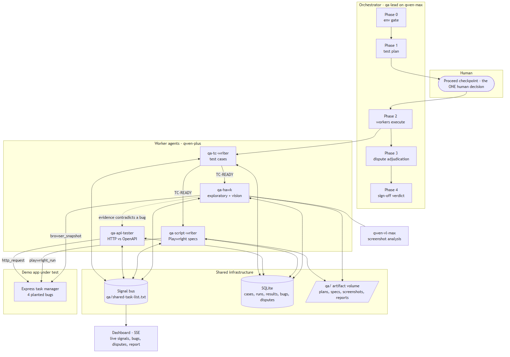
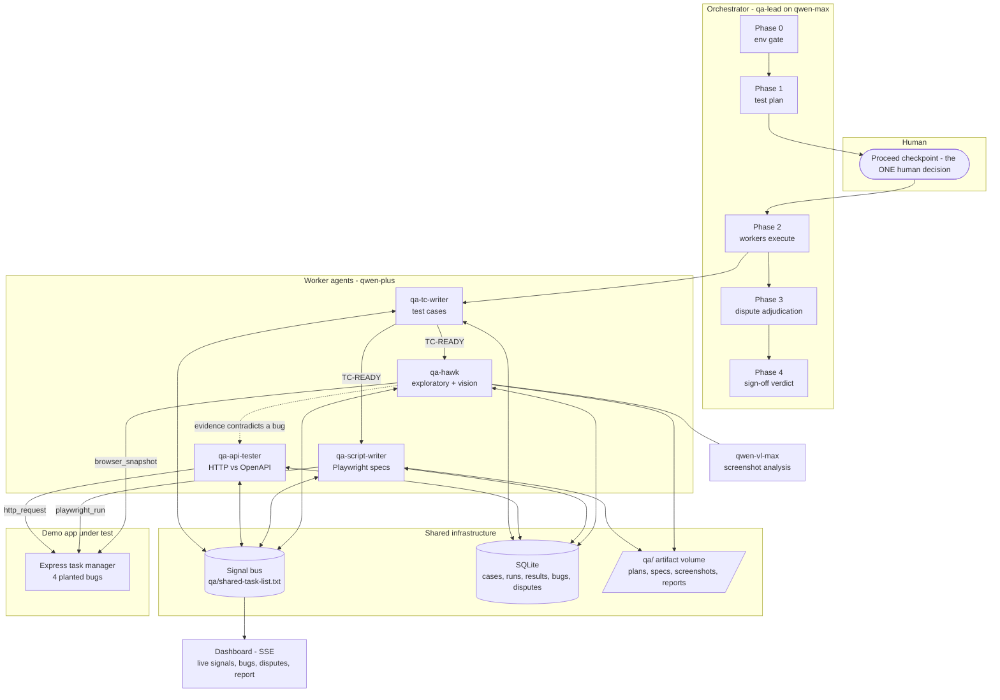

# Architecture

AG-QREW is a society of five Qwen-powered agents built on **one reusable `AgentLoop`**
([orchestrator/src/agentLoop.ts](../orchestrator/src/agentLoop.ts)) — a chat → tool-calls →
tool-results loop over the Qwen function-calling API, instantiated five times with different
(system prompt, model tier, tool registry) configs. There is no agent framework underneath;
the runtime is the project.

## The pieces

| Component | File | What it does |
|---|---|---|
| Agent loop | `orchestrator/src/agentLoop.ts` | The reusable engine: chat → execute `tool_calls` → append results → loop. Guards: max iterations, token budget, `BLOCKED` signal path instead of crashing |
| Qwen client | `orchestrator/src/qwen.ts` | DashScope (Model Studio) via the OpenAI-compatible endpoint; retry + backoff on 429/5xx. **This is the Alibaba Cloud API usage file** |
| Orchestrator | `orchestrator/src/agents/qaLead.ts` | Owns phases 0–4, the proceed checkpoint, dependency-ordered worker groups, and the dispute-adjudication drain |
| Worker factory | `orchestrator/src/agents/worker.ts` | Loads each ported prompt and builds its loop — the run ORDER encodes the pipeline, not per-agent classes |
| Signal bus | `orchestrator/src/bus.ts` | Append-only `qa/shared-task-list.txt`; grammar in [signals.md](signals.md) |
| Persistence | `orchestrator/src/db.ts` | SQLite: `test_cases`, `runs`, `results`, `bugs`, `disputes` — replaces TestRail/Jira |
| Tool layer | `orchestrator/src/tools/*` | One typed function + JSON schema per capability: bus, store, fs (sandboxed to `qa/`), http, playwright_run, browser_snapshot (→ qwen-vl), raise_dispute |
| Adjudication | `orchestrator/src/adjudicate.ts` | Dispute → one rebuttal round by the original filer → QA Lead rules: UPHELD / DOWNGRADED / REJECTED / RECLASSIFIED |
| Baseline | `orchestrator/src/baseline/singleAgent.ts` | The same job as ONE monolithic loop with all tools — the Track-3 comparison |
| Server + dashboard | `orchestrator/src/server.ts` | Express + SSE: live signal feed, bug/dispute list, Start + Proceed buttons |
| Demo app | `demo-app/` | Express task manager with **4 planted bugs** (`PLANTED_BUGS.md`) so the pipeline's recall is verifiable |

## Model routing

| Model | Used by | Why |
|---|---|---|
| `qwen-max` | qa-lead (plan, adjudication, sign-off) | strongest reasoning where judgment matters |
| `qwen-plus` | the four workers | cheap + fast for high-volume tool-calling |
| `qwen-vl-max` | inside `browser_snapshot` | multimodal screenshot analysis for qa-hawk |

## Phases

0. **Env gate** — qa-hawk verifies the target is reachable and creds work; `BLOCKED` halts before any test effort is spent.
1. **Test plan** — qa-lead (Mode 1) turns the requirements doc into a plan with an SFDIPOT coverage map.
2. **Checkpoint** — the one human decision: approve the plan (dashboard button, stdin, or auto).
3. **Workers** — dependency-ordered: qa-tc-writer first (emits `TC-READY`), then qa-script-writer + qa-hawk in parallel, then qa-api-tester (whose API evidence can contradict UI findings).
4. **Adjudication** — every open dispute gets a rebuttal round, then a ruling by the QA Lead.
5. **Sign-off** — qa-lead (Mode 2) writes the report; the verdict (PASS / CONDITIONAL PASS / FAIL) is computed deterministically from the DB, not vibes.
